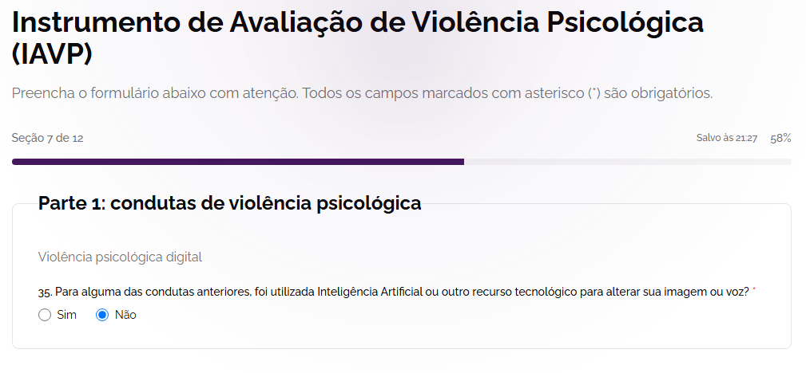
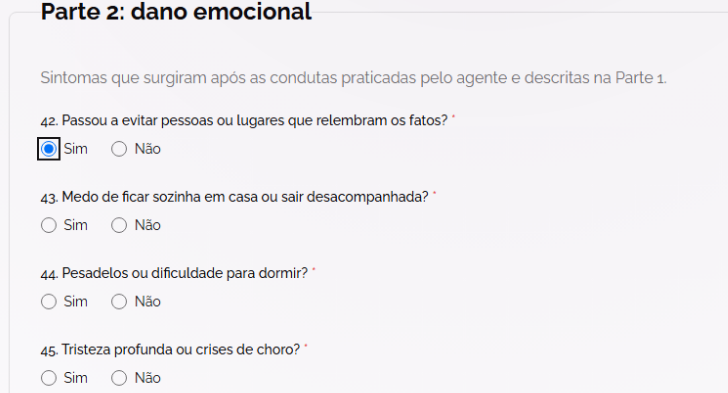
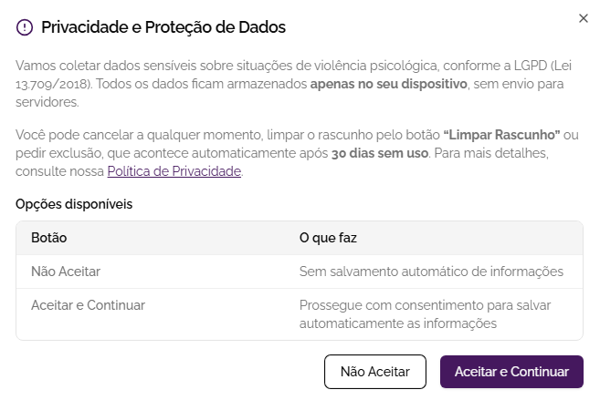
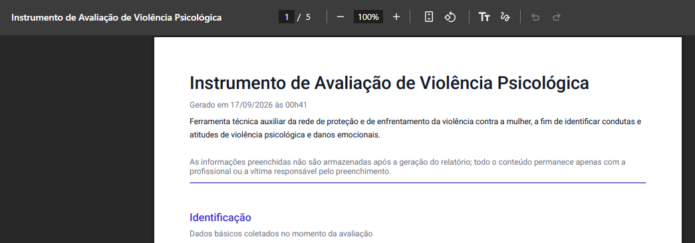

# Entrega 2 — Público-alvo e análise de concorrência

**Data:** 27/08/2026 
**Status:** 🟨 em andamento 
**Responsabilidade mínima:** cada integrante analisa pelo menos 1 concorrente/interface representativa; a equipe produz síntese comparativa.

## Objetivo da atividade

Compreender soluções do mesmo domínio **e também interfaces familiares ao público-alvo**. O objetivo não é copiar telas, mas identificar convenções, padrões, affordances percebidas, problemas recorrentes, expectativas e oportunidades de design.

> **Concorrente não precisa ser idêntico ao produto.** Pode atuar na mesma área, resolver objetivo semelhante ou disputar a mesma necessidade. Quando não houver concorrente direto, use produtos análogos e softwares que o público já utiliza.

### Para TCCs que não previam interface

Não procure apenas um “concorrente do algoritmo”. Investigue **interfaces profissionais que materializam atividades semelhantes** às que o usuário escolhido precisaria realizar.

Exemplos:

- TCC de banco de dados → consoles de administração, ferramentas para DBA, monitoramento e análise de consultas;
- TCC de LLM/ML → painéis de experimentos, gestão de modelos/datasets, comparação de métricas, revisão de resultados;
- TCC de análise de dados → dashboards, ferramentas de BI, filtros, relatórios e exploração;
- TCC de infraestrutura/API → portais administrativos, observabilidade, logs, gestão de credenciais e uso;
- TCC de cibersegurança → consoles de alertas, triagem, histórico e auditoria.

A pergunta é: **“que convenções esse perfil já conhece para executar tarefas equivalentes?”**

## Entrada obrigatória da Entrega 1

Retome o mapa inicial de alternativas e produtos citado na Entrega 1. Aqui a equipe deixa de trabalhar apenas com impressão inicial e passa a **investigar sistematicamente** cada solução.
| Item citado na Entrega 1 | Tipo | Por que foi citado | Status inicial | Decisão nesta entrega |
|---|---|---|---|---|
| Lumira | concorrente/análoga do domínio | Atua em necessidade próxima de orientação e identificação de violência | F/H | analisar como C02 |
| IAVP (Ministérios Públicos) | análogo institucional |	Mesma base legal (Art. 147-B do Código Penal) usada como referência oficial de triagem, porem preenchido por profissional humano | F | analisar como C01 |
| Be Safe Mulher | concorrente/análoga do domínio | Atua em contexto de proteção, orientação e apoio à mulher | F/H | analisar como C03 |
| Instituto Glória | concorrente/análoga do domínio |	Atua em apoio, orientação e enfrentamento à violência | F/H | analisar em resumo ou como C04 |

Se uma hipótese da Entrega 1 for confirmada ou refutada durante esta análise, atualize `H01`, `H02`... em [`../RASTREABILIDADE.md`](../RASTREABILIDADE.md).

## 1. Público-alvo desta análise

Conforme definido na Entrega 1, o usuário principal priorizado para IHC é o administrador/analista autorizado do sistema. Esse usuário acessará a interface web administrativa para acompanhar e compreender os dados gerados pelas análises de conversas.

Seu objetivo principal é conseguir transformar um conjunto grande de registros individuais em informação útil, realizando tarefas como:

- visualizar indicadores gerais no dashboard;

- consultar o histórico de análises;

- aplicar filtros por período, nível de risco e categoria;

- pesquisar registros específicos;

- abrir e analisar o detalhe de uma conversa/resultado;

- observar tendências e padrões no conjunto de dados;

- interpretar os resultados sem perder o contexto.

A vítima continua sendo usuária direta do sistema, porém do outro ponto de interação: ela recebe uma mensagem ou conversa suspeita do possível agressor, encaminha esse conteúdo ao chatbot pelo WhatsApp e recebe a análise individual. Esse fluxo é importante para entender a origem dos dados, mas não é o foco principal da interface administrativa estudada nesta entrega.

## 2. Concorrentes diretos/indiretos

### Análise C01 — IAVP (Instrumento de Avaliação de Violência Psicológica, Grupo de Trabalho Pandora / Ministérios Públicos estaduais)

**Autor(a):** Laura de Souza Parente — 22.123.033-7 
**Tipo:** análogo institucional / metodológico
**Link oficial:** [{{IAVP}}](https://iavppandora.insightlab.ufc.br/iavp)  
**Data de acesso:** 27/08/2026

#### Contexto e proposta

O IAVP foi desenvolvido pelo Grupo Pandora, formado por profissionais das áreas de Direito, Psicologia e Psiquiatria. Seu objetivo é auxiliar na identificação de condutas de violência psicológica e do dano emocional associado, tomando como referência o art. 147-B do Código Penal.

O instrumento pode ser preenchido diretamente pela vítima, embora o próprio material de aplicação recomende, quando possível, o acompanhamento de profissional capacitada nas áreas de saúde, assistência social, segurança pública ou jurídica.

Para o nosso projeto, o IAVP é relevante principalmente porque demonstra uma forma estruturada, fundamentada e institucional de organizar a avaliação de violência psicológica, mesmo sem realizar análise automatizada de conversas.

#### Funcionalidades relevantes

| Funcionalidade | Como é realizada | Evidência/print | Observação de IHC |
|---|---|---|---|
| Formulário estruturado de avaliação | Preenchido pela propria vitima, mas é recomendado quando possivel se preenchido por profissional habilitado, buscando identificar constrangimento, humilhação, manipulação, isolamento, ameaças, violência digital, entre outras categorias |    | A divisão em etapas reduz a quantidade de informação apresentada de uma vez, mas aumenta o número de passos |
| Identificação de condutas de violência psicológica | O instrumento apresenta perguntas relacionadas a constrangimento, humilhação, controle, isolamento, ameaças e outras condutas | | Estrutura e terminologia podem ajudar a organizar categorias exibidas no detalhe de uma análise |
| Avaliação de dano emocional | Há uma parte específica voltada aos impactos emocionais associados à situação de violência |  | Mostra a importância de separar comportamento identificado de consequência emocional |
| Aviso de privacidade e tratamento de dados sensíveis | A interface informa que os dados são sensíveis e apresenta orientações antes do preenchimento |  | Transparência sobre dados é especialmente relevante para nosso painel administrativo |
| Salvamento local do rascunho | A interface informa que o rascunho pode ser mantido localmente no dispositivo e permite desabilitar esse recurso |  | Demonstra preocupação explícita com privacidade e controle do usuário |

#### Experiência do usuário e opiniões

Use avaliações públicas, relatos, estudos, testes próprios ou outra fonte identificável. Não trate opinião isolada como verdade universal.

Nas fontes oficiais consultadas não foram encontradas avaliações públicas de usuários em quantidade suficiente para concluir que a interface é fácil ou difícil de usar. Portanto, não é adequado tratar satisfação ou usabilidade percebida como fato.

Em uma análise exploratória da própria interface, entretanto, é possível observar alguns elementos objetivos: o formulário é dividido em seções, campos obrigatórios são identificados, existe aviso de coleta de dados sensíveis e a interface comunica o comportamento do salvamento local. Esses pontos ajudam a reduzir incerteza durante o preenchimento, mas a quantidade de perguntas e a extensão do instrumento podem aumentar o esforço necessário para conclusão.

#### Preço/modelo de negócio

Não foi identificado modelo comercial ou cobrança para utilização do instrumento na página oficial consultada. O IAVP é apresentado como uma ferramenta institucional de apoio à identificação e enfrentamento da violência psicológica.

#### Padrões e tendências percebidos

- formulário dividido em etapas;

- uso de linguagem vinculada ao domínio jurídico e psicológico;

- separação entre condutas do agressor e dano emocional;

- indicação explícita de campos obrigatórios;

- aviso de privacidade antes da coleta de dados sensíveis;

- preocupação em orientar quem deve preencher e em qual contexto.

#### Pontos positivos, limitações e lições

| Ponto | Evidência | Implicação para nosso projeto |
|---|---|---|
| Base técnica e jurídica explícita | IAVP organizado a partir do art. 147-B e desenvolvido por equipe interdisciplinar | O painel deve deixar clara a origem/fundamentação das categorias e resultados |
| Estrutura padronizada | Instrumento dividido em partes e perguntas organizadas | Categorias e informações do nosso sistema também devem seguir uma organização consistente |
| Preocupação com privacidade | A interface apresenta aviso sobre dados sensíveis e armazenamento | O painel administrativo precisa comunicar e limitar o acesso a conteúdo sensível || Avaliação manual e estruturada | O preenchimento depende de respostas fornecidas pela vítima/profissional | Nosso sistema se diferencia ao analisar automaticamente mensagens/conversas |
| Não possui foco em análise agregada de muitos casos | A interface observada é voltada ao preenchimento individual | Existe oportunidade para nosso dashboard apoiar visão geral, histórico e comparação |

### Análise C02 — Lumira

**Autor(a):** Laura de Souza Parente — 22.123.033-7 
**Tipo:** concorrente indireto / análogo do domínio
**Link oficial:** [{{URL}}](https://iavppandora.insightlab.ufc.br/iavp)  
**Data de acesso:** 05/09/2026

#### Contexto e proposta

A Lumira é uma aplicação voltada ao acolhimento e orientação de mulheres em situação de vulnerabilidade ou violência doméstica. Atua principalmente por meio de uma assistente virtual/chatbot e conteúdos informativos sobre tipos de abuso.

#### Funcionalidades relevantes

| Funcionalidade | Como é realizada | Evidência/print | Observação de IHC |
|---|---|---|---|
| Chatbot de orientação inicial | Respostas automatizadas em fluxo guiado por texto | `../assets/02_concorrencia/...` | Simplifica a linguagem para o usuário leigo, mas limita o envio de grandes textos. |
| Conteúdo educativo categorizado | Cartões explicativos sobre violência psicológica, moral e física | `../assets/02_concorrencia/...` | As categorias de abuso são apresentadas com ícones e exemplos simples. |

#### Experiência do usuário e opiniões

Use avaliações públicas, relatos, estudos, testes próprios ou outra fonte identificável. Não trate opinião isolada como verdade universal.

A interface prioriza tons suaves e navegação simples. No entanto, foca exclusivamente na ponta final (vítima) e não oferece transparência ou painéis de acompanhamento de dados para órgãos de apoio ou gestores.

#### Preço/modelo de negócio

Gratuito para o usuário final / Parcerias institucionais.

#### Padrões e tendências percebidos
- Comunicação empática e direta;

- Organização das formas de abuso em categorias visuais legíveis.

  
#### Pontos positivos, limitações e lições

| Ponto | Evidência | Implicação para nosso projeto |
|---|---|---|
| Categorização clara de violência | Exibição visual dos tipos de violência doméstica | Inspirar a forma como as categorias são rotuladas no detalhe da análise no nosso painel |
| Ausência de painel analítico | A ferramenta não possui visão administrativa pública/agregada | Oportunidade para o nosso TCC preencher a lacuna de acompanhamento de dados e tendências |

### Análise C03 — Be Safe Mulher

**Autor(a):** Laura de Souza Parente — 22.123.033-7 
**Tipo:** concorrente indireto / análogo do domínio
**Link oficial:** [{{Be Safe Mulher}}](https://app.defesadamulher.com.br/)  
**Data de acesso:** 05/09/2026

#### Contexto e proposta

Plataforma com foco em segurança pessoal, acionamento de rede de emergência, geolocalização e orientações de proteção à mulher.

#### Funcionalidades relevantes

| Funcionalidade | Como é realizada | Evidência/print | Observação de IHC |
|---|---|---|---|
| Botão de emergência / Alerta |  Acionamento rápido por toque único enviando localização | `../assets/02_concorrencia/...` | Alta eficiência para situações de risco iminente. |
| Cadastro de rede de apoio | Inclusão de contatos de confiança para envio automático de mensagens | `../assets/02_concorrencia/...` | Requer passos prévios de configuração. |

#### Experiência do usuário e opiniões

Use avaliações públicas, relatos, estudos, testes próprios ou outra fonte identificável. Não trate opinião isolada como verdade universal.

Focada em ação rápida mobile. Possui forte apelo de privacidade no aparelho do usuário, mas não realiza análise de inteligência artificial sobre conteúdos de texto/áudio nem consolidadores de dados analíticos.

#### Preço/modelo de negócio

Modelo Free / Serviços corporativos e públicos.

#### Padrões e tendências percebidos
Priorização absoluta da privacidade e facilidade de disfarçar/fechar a aplicação.

#### Pontos positivos, limitações e lições

| Ponto | Evidência | Implicação para nosso projeto |
|---|---|---|
| Foco em privacidade extrema | Recursos para ocultaçāo rápida de tela | Reforça a necessidade do nosso painel administrativo mascarar dados pessoais sensíveis por padrão |
| Foco exclusivo em emergência pontual | Não analisa o conteúdo de conversas suspeitas | Nosso projeto atua na etapa anterior (identificação do padrão de abuso) |

### Análise C04 — Instituto Glória

**Autor(a):** Laura de Souza Parente — 22.123.033-7 
**Tipo:** concorrente indireto / análogo do domínio
**Link oficial:** [{{Instituto Glória}}](https://eusouagloria.com.br/home)  
**Data de acesso:** 08/09/2026

#### Contexto e proposta

Plataforma que utiliza inteligência artificial (a atendente virtual "Glória") para escuta, acolhimento e coleta de dados sobre violência contra mulheres e meninas, visando a transformação social.

#### Funcionalidades relevantes

| Funcionalidade | Como é realizada | Evidência/print | Observação de IHC |
|---|---|---|---|
| Escuta estruturada via IA | Conversação via chat interativo para mapear a situação | `../assets/02_concorrencia/...` | Interface conversacional acolhedora e acessível. |
| Mapeamento de dados de violência | Coleta interna de relatos para gerar estatísticas institucionais | `../assets/02_concorrencia/...` | Demonstra a importância de agregar dados para gerar conhecimento. |

#### Experiência do usuário e opiniões

Use avaliações públicas, relatos, estudos, testes próprios ou outra fonte identificável. Não trate opinião isolada como verdade universal.

A assistente virtual é bastante reconhecida pelo acolhimento, mas as justificativas técnicas e legais de como as classificações de risco são feitas não são expostas de forma transparente para o analista no resultado final.

#### Preço/modelo de negócio

Organização sem fins lucrativos / Parcerias governamentais e privadas.

#### Padrões e tendências percebidos
Utilização de IA para processamento de linguagem natural no acolhimento de relatos.

#### Pontos positivos, limitações e lições

| Ponto | Evidência | Implicação para nosso projeto |
|---|---|---|
| Uso de IA no acolhimento | Interação natural por chat |  Valida a escolha do chatbot via WhatsApp no nosso ecossistema |
| Pouca explicabilidade nos veredictos | Respostas diretas sem fundamentação jurídica visível | Nosso painel se diferencia ao exibir a fundamentação RAG com o Art. 147-B e referências |

> Repita a subseção para C02, C03... até atender à quantidade da equipe.

## 3. Softwares que o público-alvo usa no cotidiano

Analise interfaces que moldam a expectativa do público, mesmo que não sejam concorrentes.

| Software | Por que o público usa | Padrões relevantes | Prints | O que aprender |
|---|---|---|---|---|
| Power BI | Referência profissional para acompanhamento de indicadores e exploração de dados | dashboard, cards, gráficos, filtros, tabelas | {{link local}} | Como organizar visão geral e permitir aprofundamento sem perder contexto |
| Looker Studio | Referência de relatórios e dashboards interativos | iltros visíveis, controles, gráficos, páginas de relatório | {{link local}} | Como permitir exploração visual do conjunto de dados |
| Excel / planilha eletrônica | Referência comum para consulta, ordenação e filtragem de registros | linhas/colunas, busca, ordenação, filtros | {{link local}} | Como tornar o histórico eficiente para localizar registros |
| WhatsApp | Canal usado pela vítima para enviar a conversa suspeita e receber a resposta | conversa em mensagens, histórico cronológico, feedback de envio | {{link local}} | Entender a origem do conteúdo que depois aparece no painel administrativo |

## 3.1 Padrões de interface relevantes ao escopo de IHC

Registre somente padrões encontrados nas soluções analisadas e que possam ter relação com objetivos reais da equipe.

| Padrão observado | Produto(s) | Para qual tarefa serve | Vantagem percebida | Risco/limitação | Aplicável ao nosso escopo? |
|---|---|---|---|---|---|
| dashboard | Power BI, Looker Studio | obter visão geral dos dados | permite perceber indicadores e tendências rapidamente | excesso de métricas pode confundir | sim |
| relatório | Power BI, Looker Studio | reunir gráficos e informações relacionadas | centraliza informações relevantes | pode ficar visualmente carregado| sim |
| histórico + filtros | Power BI, Looker Studio, planilhas | localizar subconjuntos e registros | reduz esforço de busca | filtros ativos podem passar despercebidos | sim |
| administração/CRUD | não evidenciado como necessidade nas referências analisadas até o momento | alterar cadastros/configurações | pode apoiar manutenção do sistema | não existe tarefa suficientemente definida que justifique CRUD neste momento | talvez/não |
| comparação de resultados | Power BI, Looker Studio | comparar períodos, categorias ou níveis | facilita identificação de diferenças | comparação sem contexto pode gerar interpretação errada | sim/talvez |

> O objetivo não é concluir “todo concorrente tem dashboard, então teremos um”. O padrão só será adotado se apoiar uma tarefa rastreável.

## 4. Síntese comparativa da equipe

| Critério | C01 (IAVP) | C02 (Lumira) | C03 (Be Safe Mulher) | Oportunidade para o projeto |
|---|---|---|---|---|
| Navegação | Formulario sequencial em etapas | Fluxo guiado por chat / menu simples | Menu inferior mobile / telas diretas | Criar navegação em níveis no painel web (Visão Geral -> Filtro -> Detalhe do Registro). |
| Feedback/estado | Indicadores de progresso no preenchimento | Respostas diretas da assistente no chat | Confirmação visual de acionamento | Exibir claramente o status do processamento da IA e o nível de confiança do veredicto. |
| Prevenção/recuperação de erro | Mensagens explícitas de aviso sobre dados sensíveis | Confirmação de intenção no diálogo | Confirmações em passos críticos de SOS | Adicionar avisos e modais de confirmação ao abrir conteúdos íntegros e sensíveis no painel. |
| Terminologia | Jurídica e psicológica formal (Art. 147-B) | Conformativa, simples e acessível | Focada em segurança pessoal | Conciliar a terminologia jurídica/acadêmica no detalhe com rótulos e cards simples na visão geral. |
| Acessibilidade | Leitura limpa e bom contraste em formulário | Interface moderna com boa legibilidade | Botões grandes de fácil acionamento | Desenvolver layout responsivo com alto contraste e densidade de informação controlada. |
| Eficiência | Baixa para análise em lote (preenchimento manual) | Média para o usuário final | Alta para acionamentos pontuais | Alta eficiência analítica: busca instantânea, ordenação por risco e filtros combinados em tela única. |

## 5. Recomendações derivadas

Liste recomendações com origem explícita.

- **RC01:** Incorporar um aviso de confidencialidade/privacidade e implementar mascaramento automático de dados de identificação na listagem geral do painel (derivada do IAVP - C01 e Be Safe - C03).
- **RC02:** Exibir no detalhe da análise a justificativa em formato de explicabilidade, com destaques nos trechos da conversa e citação direta da base legal (Art. 147-B) (derivada da falta de explicabilidade observada no Instituto Glória - C04).
- **RC03:** Adicionar cards sintéticos com contadores por nível de risco (Alto, Médio, Baixo) no topo do dashboard principal (derivada dos padrões de BI observados no Power BI / Looker Studio).

## Referências

{{fontes dos produtos, avaliações e literatura}}

- GRUPO PANDORA. IAVP: Instrumento de Avaliação de Violência Psicológica. Disponível em: https://iavppandora.insightlab.ufc.br/iavp
- INSTITUTO GLÒRIA. Disponível em: https://eusouagloria.com.br/home
- Be Safe Mulher. Disponivel em: https://app.defesadamulher.com.br/
- Lumira.  Disponivel em:

## Checklist

- [x] O mapa inicial de alternativas da Entrega 1 foi revisitado e aprofundado.
- [ ] Hipóteses relevantes sobre mercado/padrões foram atualizadas na rastreabilidade quando surgiram evidências.
- [ ] Há pelo menos uma análise completa por integrante.
- [ ] Cada análise contém prints legíveis da interface.
- [ ] Prints mostram telas/estados relevantes, não apenas logos/homepage.
- [x] Foram analisados concorrentes e/ou interfaces representativas ao público.
- [ ] Em TCC sem interface original, foram investigadas ferramentas profissionais análogas às atividades do usuário escolhido.
- [x] Padrões como dashboard, relatório, filtros e CRUD foram analisados como soluções para tarefas, não como requisitos automáticos.
- [ ] Opiniões de UX têm fonte.
- [ ] A síntese compara critérios comuns e produz recomendações.
- [x] Não há “copiar porque o concorrente faz”; há justificativa de adequação ao público/contexto.
